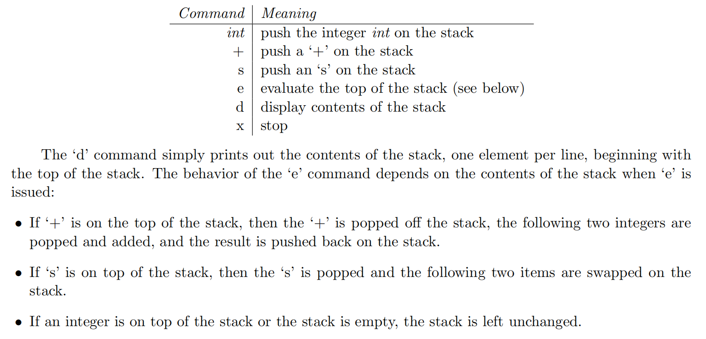
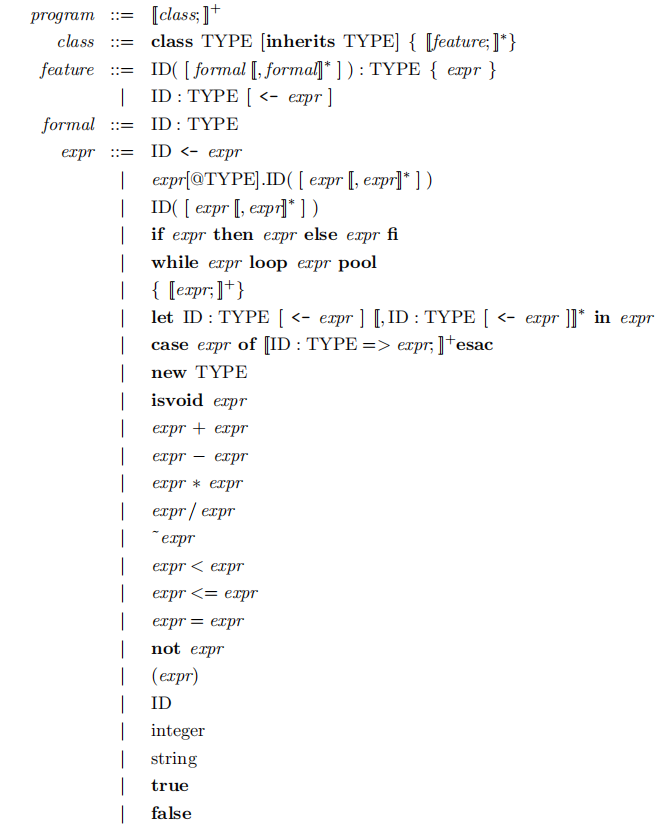

# CS143
斯坦福2022春编译原理实验

cs143官方网站：http://web.stanford.edu/class/cs143/

此处的实验一与官网不同，官网是直接开始做词法分析，而本实验一是熟悉cool语言。cool语言是用于教学的面向对象语言，Classroom Oriented Object Language。注意，在做实验之前，一定
要熟悉好cool语言，毕竟你是要开发cool语言的编译器的，不熟悉cool语言语法怎么写编译器呢嘻嘻。主要是对cool_manual.pdf的阅读，我认为看1-12章即可。注意一定要熟悉.

## PA1

实验一是写一个栈机器，目的是熟悉cool语言。我觉得关键在三点。

一是熟悉题目要求：如图

二是熟悉cool语法：

由于cool编译器非常不友好，报错很不明显。所有必须先熟悉好cool语法才能写下去。我就是一开始太急了，没有完全熟悉就开始写（老毛病了）。我犯错：一没有明白对象的字段全部是私有的，
在外部不能直接调用，manual原文： Attributes are visible throughout a class in which they are declared or inherited,二不知道不能对self进行赋值，self是不能修改的，原文：
The identifier self may be referenced, but it is an error to assign to self or to bind self in a let, acase, or as a formal parameter. It is also illegal to have 
attributes named self.二者均可以用设立setter和getter方法去破解。熟悉了语法，做起来还是很轻松的。

三是是注意atoi.cl文件的使用，可以调用A2I类相关接口实现String和Int之间的转化。指导书原文：If you wish, youmay use the classes defined in atoi.cl

注意以上三点，实验一还是很轻松的

## PA2

从实验二开始就正式进入编写cool语言编译器了。实验二是词法分析，使用工具flex。实验三是语法分析，使用工具bison。实验四是语义分析，实验五是汇编代码生成。在每个实验笔记中，我不
仅会说出实验思路与注意点，还会从一个编译器整体的角度，分析各个部分的所做。

首先说明下实验二需要阅读学习的部分：

- cool-manual 第10章 lexical structure

- flex-manual，重点是三大模块的前两个结构规范，flex函数与变量

- PA2.pdf

需要修改的文件：cool.flex

官方评测脚本：https://courses.edx.org/assets/courseware/v1/2aa4dec0c84ec3a8d91e0c1d8814452b/asset-v1:StanfordOnline+SOE.YCSCS1+1T2020+type@asset+block/pa1-grading.pl

评测步骤：

- make clean

- make lexer

- perl pa1-grading.pl

词法分析大概可以分为一下几个部分：

- 单行注释
- 多行注释
- 字符串常量
- 关键字
- 布尔常量
- 数字常量
- 标识符
- 类型名
- 运算符号及其他符号
- 空白符号
- 其他

除了前三个，后面较为简单。注意运算符号好像没有>，可通过实验给的lexer测出来的，空白符这不要漏掉空格。其余均可在指导书中获取信息。

首先解析前三个如何词法分析。这三个分别为single_line,comment,string状态。

### 单行注释

若遇到--则进入single_line，结束标志为换行符。

### 多行注释

若遇到（* 则进入comment，在多行注释中需要注意：

若遇到eof，则转入initial状态，否则接下来识别的文件还是comment，会陷入无限循环。

其次必须要能够处理嵌套注释，根据提示修改，在<INITIAL,COMMENT>两种状态下遇到（* 时将嵌套深度++。遇到*）时将嵌套深度--，嵌套深度为全局静态变量，初始值为0

### 字符串

若遇到"则进入string，需要注意：

遇到eof则需要转入initial状态。还需注意yyrestart(yyin)，看flex文档说明（做之前一定要看明白flex-manual，里面很详细很全！！！）

遇到\\则分情况讨论，若接下来是\n，则需要行数++，其余只需继续匹配即可。

遇到\n则返回error。

注意空字符串出错：如果字符串中出现null，必须坚持识别完整个字符串，而不是遇到null就报错，从下一个又继续开始识别。所以遇到\0照样接收，只是最后遇到"结束
时扫描整个字符串，遇到\0则整个识别为error就行。

遇到"则识别结束，开始相关处理。

+ 首先是上面提到不能有\0,有则直接报错
+ 其次对转义字符处理
+ 判断是否超过最大长度

### 其他

接下来的识别都很简单，注意顺序问题，true与false的识别一定要在标识符及类型前面，否则true与false会被识别为标识符造成出错！！！

最后是空字符的识别：应该是如下几个 \t\r\f\v\n，遇到\n注意换行，不要漏了空格！也是没有仔细阅读cool-manual 第10章 lexical structure。

### 词法分析 lexical analysis （lexer）

通过flex生成相关cpp代码进行词法分析，对若干输入文件的内容，包括单行注释、多行注释、字符串常量、关键字、布尔常量、数字常量、标识符、类型名、运算符号、空白符号及其他符号进行
扫描，对注释进行删除、对其余合法符号生成token，同时对于字符串常量、数字常量、标识符则加入stringtable中记录之。对不合法符号生成ERROR token。我们可以看到本次实验，词法分析的
过程就是顺序扫描所有输入文件，生成token序列的过程。token序列将作为语法分析的输入。

## PA3

实验三是语法分析，使用bison，如果没有flex和bison的基础（比如我）可能得耽误不少时间去学习。

实验三需要阅读的部分：

- PA3.pdf

- bison-manual

- cool-tour.pdf第六章（PA3有提及）

- cool-manual 第11章和第12章最前面（不需阅读12.1）

需要修改的文件：cool.y

官方评测脚本：https://courses.edx.org/asset-v1:StanfordOnline+SOE.YCSCS1+1T2020+type@asset+block@pa2-grading.pl

评测步骤：

make clean

make lexer

make parser

perl pa2-grading.pl

语法分析，在阅读完以上代码后，最主要还是对下面这张图，按此图来写基本上差不多的，当然也有一些小细节需要注意：

第一个是let的书写，由于let也存在递归结构，单独分出lettype可以更方便地去书写。

第二个是注意formal的expression和其他的expression是有区别的，它们直接是"，"隔开，我一开始一直没有找到这个区别，导致评分一直没有上去

最后就是错误处理，可以看cs143的视频关于语法分析错误处理部分，我的理解主要就是递归出现的地方，需要加上错误处理：class_list、feature_list、 exp_list、let四个地方

生成语法分析树的过程，自顶向下的图大概是（主要关注层级关系）

                                       program
                                          |
                                       classes
                                    /.....|.......\
                                class1  class2  class3
                                ............      |
                                                features
                                            /.....|.......\
                                        method1.........attr1...
                                           |            
                                  formals...exps    
                                              |
                                         branchs.....let......exp
         
其余注意调用相关函数生成语法分析树即可。

### 语法分析 parsing

语法分析分为自顶向下分析LL(1)和自底向上分析SLR,LR(1)和LALR。一般而言自顶向下分析局限性大，bison生成的代码是LALR分析。以token序列作为输入，输出抽象语法分析树ast。参见
include/cool-tree.cc，会有不同类型的节点继承tree_node。我们可以看到本次实验的代码，语法分析的过程就是自底向上建立ast的过程，我们遇到合适的输入，则生成代表非终结符的ast节点
作为语义分析的输入。

## PA4

首先说明一下需要仔细阅读的材料：

- PA4.pdf
    
- cool-manual 第12章
    
- symtab.h与tree.h相关接口
    
主要需要修改的文件：cool-tree.h  semant.h  semant.cc

官方评测脚本：wget https://courses.edx.org/assets/courseware/v1/2aa4dec0c84ec3a8d91e0c1d8814452b/asset-v1:StanfordOnline+SOE.YCSCS1+1T2020+type@asset+block/pa3-grading.pl

    
下面说明一下思路：

实验要求：输入没有type的ast，输出有type的ast。即每个表达式都要有type的标记，同时还有检查是否有错误。原文：The semantic phaseshould correctly annotate ASTs with types and 
should work correctly with the coolc code generator.

错误的处理：PA4.pdf原文：You are expected to recoverfrom all errors except for ill-formed class hierarchies.故若第一次遍历出错，则直接结束语法制导翻译。其他错误则抛开此
小错误，从下一个继续开始。

关键数据结构1：ClassTable

添加两个unordered_map，一是inherit_map，存储类继承图；二是class_map，存储类名和类变量的对应关系。

关键数据结构2：Envmt（第二次遍历想到）

SymbolTable是符号表，定义在symtab.h，存储标识符的名称和类别，这是它的关键接口：enterscope()、exitscope()、addid(SYM s, DAT *i)、lookup(SYM s)、probe(SYM s)，它一个
ClassTable，以及current_class构成了环境。

program_class类的semant方法是语法制导翻译的入口，是语法制导翻译的核心代码，以下所有都围绕此方法展开。

+ 首先调用initialize_constants()，将所有关键字加入idtable中，以免出现变量名为关键字情况。

+ 其次semant方法中，实验给的代码调用了ClassTable的构造函数，传入的参数则是包括除了所有非基本类的所有类的链表classes。所以，我们必须在构造方法中将所有类加入到table中。

    * 在构造方法中，首先会调用基本类的初始化install_basic_classes()，此方法应该修改，方法最后调用调用add_class_to_classtable()，将5个基本类加入table。

    * 调用add_class_to_classtable()，然后将传入的classes链表中所有类加入table。
        
        - add_class_to_classtable()中，主要是对加入时的类进行一次检查，此次检查主要是三个判断：类名不能是SELF_TYPE；不能继承Str、Bool和Int三个基本类；类不能重复定义。
          PA4.pdf提到过：In addition, Cool has restrictions on inheriting from the basic classes (see the manual). It is also an error if class A inherits from class B 
          but class B is not defined. 为什么在这里对这三个进行检查，是因为这三个检查成本低，在加入时即可检查，而且检查条件不像检查继承图是否无环那样需要所有类都加入后才能
          检查。在满足上述三个条件后，将此class加入inherit_map和class_map中。若检查出错，则不能加入到table，注意我们的一开始写的错误检查原则。使用semant_error记录错误。

+ 然后开始第一次遍历ast，主要是检查是否无环、是否未定义Main类，是否继承的类未被定义，这三个检查必须是所有类都被加入继承图，才能检查。可以通过一次遍历完成所有检查。
    
    * 无环检查主要是对哈希表的每一项，不停求其父节点，直到到达No_type，假如最后到达了自己，则有环。
        
+ 若第一次遍历出错则不能进行第二次ast遍历。第二次ast遍历更为复杂，主要是scope check和type check，注意除了二者之外还有其他的。需要用到环境，代表omc

+ 第一次遍历未出错，进行第二次遍历。首先是环境新建，传入之前class_table作为参数
    
+ 开始遍历classes里面的所有类
    
+ 首先进入到该类作用域,明确以下什么时候需要enterscope()和exitscope()，PA4.pdf说：Besides the identifier self, which is implicitly bound in every class, there are four 
  ways that an objectname can be introduced in Cool:attribute definitions;formal parameters of methods;let expressions;branches of case statements。也就是说，除了
  进入每个类，还要在这四个地方进行enterscope()和exitscope()。
    
+ 对该类的所有属性进行收集gather_attribute()，放入SymbolTable符号表，因为属性在类中是全局的
    
    * gather_attribute()中，注意，首先应该将所有祖先的attrubite加入，这里使用递归。
        
    * 然后再加入自己类的，若发生重复定义，则报错，不将其加入table，继续处理其他属性。注意features中不仅有属性，还有方法，对于方法，我们不做任何处理。
        
+ 最后就是最核心，最关键的一步，调用此类的type_check()。首先总的说一下，每个cool-tree.h中的inode都有自己的type_check方法，下面，我将自顶向下地去讲解所有inode类型
  type_check。注意，每一次check都将环境作为参数传递进去，返回值则是自身，返回值的作用主要是取其type进行检查。
      
      
+ 首先是class的type_check，class中有啥？attribute和method，它们都继承于feature，所以，对于class的type_check，就是对其的feature链表中每一个feature调用其type_check即可
    
    * attribute的type_check主要三步（首尾应该进入和退出作用域）：
        
        - 加入self，类型为cur_class
            
        - 对init表达式进行type_check，注意看这里开始对最主要的expression开始了type_check。有两个目的，一是对表达式的scope、type进行check，二是取返回值类型与type_decl
              进行比对
            
        - 取返回值类型与type_decl进行比对，首先只要涉及到赋值，都不能对self进行，其次判断type_decl是否存在，最后判断init_type是否为Notype，因为init表达式可以不存在。
              不为则判断祖先关系
              
    * method的type_check主要四步（首尾应该进入和退出作用域）：
         
        - 加入self，类型为cur_class
            
        - 对所有formal进行type_check
            
        - 然后是对此方法和父类方法的对比，看是否正确重写（这点容易漏）
            
        - 对方法体expr进行type_check，此处又是对表达式的type_check，这是主角。取其实际返回值
            
        - 最后是方法返回值和实际返回值对比
            
    * method的type_check和attribute的都包括对expression的type_check，这是主角，还有对formal的check，以下先介绍formal的check
        
    * 对formal的type_check，将其加入当前envmt,若重复定义，则报错

    * 对branch的type_check，直接添加name和type
        
    * expression的type_check，参考cs143课程或者cool-manual 第12章。注意到我们的主要目标就是给ast注释上type，这是expression的type_check()的功能之一。遇到错误类型表达 
      式，cs143课程提供一个解决方案：将类型Object分配给错误类型的表达式。下面是部分较难expression子类型的typecheck
      
        - assign_class 只需检查声明类型是否是表达式返回类型祖先类即可
        
        - static_dispatch_class 祖先类方法调用，首先判断是否满足祖先关系，然后检验实参类型和形参类型是否满足祖先关系，最后将type字段赋值为方法的返回值类型。
        
        - dispatch_class 方法调用，同上，只是缺少第一个
        
        - cond_class if语句，检验判断条件是否为bool类型，然后取if语句和else语句两表达式类型公共祖先为type
        
        - loop_class while语句，检验判断条件是否为bool类型，type为object
        
        - typcase_class 首先case语句各类型应该不一样，然后对各case语句取公共祖先，注意环境的改变与恢复
        
        - let_class 判断是否有表达式赋值，没有则直接改变环境对子表达式进行检查，type值也为子表达式类型，有则对赋值返回类型与声明类型进行检查是否具有祖先关系
        
        - object_class 判断是否是self，是则返回，否则在当前环境查询，若不存在则报错
          
### 语义分析 semantic analysis

我们可以看到，语义分析侧重语义检查，以语法分析生成的ast作为输入，进行一系列诸如类继承图检查，方法类型检查等等，同时进行表达式类型检查，为原来的ast的表达式节点添加type字段，
以经过检查的ast作为输出。

          
## PA5

参考：https://github.com/wangdh15/cs143

最后一个实验，代码生成

首先说明一下需要仔细阅读的材料：

    - PA5.pdf
    
    - cool-runtime 
    
    - cool-manual 第13章
    
主要需要修改的文件：cgen.h  cgen.cc

官方评测脚本：wget https://courses.edx.org/assets/courseware/v1/2aa4dec0c84ec3a8d91e0c1d8814452b/asset-v1:StanfordOnline+SOE.YCSCS1+1T2020+type@asset+block/pa4-grading.pl

说明一下思路：

了解cool-runtime之后，从PA5.pdf中可得知需要完成下列任务：

In considering your design, at a high-level, your code generator will need to perform the following tasks:

1. Determine and emit code for global constants, such as prototype objects.

2. Determine and emit code for global tables, such as the class nameTab, the class objTab, and the dispatch tables.

3. Determine and emit code for the initialization method of each class.

4. Determine and emit code for each method definition.

首先介绍相关数据结构：

subclass_idrange：记录所有类子节点classtag区间
tag_to_class：记录所有类子节点
class_depth：记录所有类在继承树中深度
sym_tbl：记录变量的偏移量（属性、局部变量、形参），同时还提供进入和退出当前作用域的接口函数，偏移量结构体见下
attr_off：所有类属性的偏移量
method_off：所有类方法的偏移量
labbelid：用于label的产生，从0开始
loc_var_off：局部变量距当前FP指针的偏移量，从-3开始

偏移量结构体：
struct Loc {
   BASE_LOC_TYPE base_loc;
   int offset;
};

偏移量基地址种类：
enum class BASE_LOC_TYPE {
   SELF_,
   FP_
};

下面再介绍相关代码的具体布局，参考cool-runtime.pdf：

+ class_nameTab

    - class_name pointer 1      
    
    - ......
    
    - class_name pointer n

+ class objTab
    
    - prototype object pointer 1
    - class_init pointer 1
    
    - ......
    
    - prototype object pointer n
    - class_init pointer n

+ dispatch_table 1
    
    - method pointer 1
    
    - ......
    
    - method pointer n
    
+ ......

+ dispatch_table n
    
    - garbage collector tag
+ prototype_obj 1
    - class tag 
    - object size (in 32-bit words)
    - dispatchTab pointer
    - attribute 1
    - ......
    - attribute n
    
+ ......

    - garbage collector tag
+ prototype_obj n
    - class tag 
    - object size (in 32-bit words)
    - dispatch pointer
    - attribute 1
    - ......
    - attribute n
    
+ ......
    
+ class_init 1

+ ......

+ class_init n

+ class1.method 1

+ ......

+ class1.method n

+ ......

+ classn.method n

方法调用时参数传递与寄存器保护：
    
+ arg n

+ ......

+ arg 1

+ old fp  <-- fp

+ t0

+ ra  <--sp

寻址类型：
    
+ SELF。靠self寻址，主要是类的属性、方法表、classtag等
+ FP。靠FP寻址，主要是实参、局部变量

代码思路：

program class::cgen(ostream&)方法是代码生成的入口，在里面调用CgenClassTable的构造方法。

+ set_tag：设置所有类的class_tag。方法是按先序遍历继承树来设置各个class的class_tag，同时记录类节点深度和子节点tag区间。至于为什么这么做见case语句的code方法。主要是参考
  此链接。
  
+ CgenClassTable::code方法：是核心，设置上面相关表的具体布局代码生成，之后完成类的初始化代码生成，最后完成所有方法的代码生成。注意，三大类没有初始化则默认初始化（对任
  意表的ref方法，没有加label则代表生成该table地址，后面加label则代表生成此表，以下提到的生成或者一些行为，比如计算a+b的值，基本指生成相关mips代码根据语境感受）依次调用
  如下方法：

    - generate_class_nameTab：生成nameTab表，按classTag顺序排放所有类名指针，原文：A table, which at index (class tag) ∗ 4 contains a pointer Data to a
      String object containing the name of the class associated。重点是：4字节，按classtag顺序来。首先必须生成classtab，注意最后加上label，然后查询到相关entry，
      调用code_ref方法生成存储指针的代码。
      
    - generate_classObj_tab：生成classObj_tab表，按classTag顺序排放prototype object指针与classinit方法指针，原文：A table, which at index (class tag) ∗ 8 contains a 
      pointer to the prototype object and at index (class tag) ∗ 8 + 4 contains a pointer to the initialization method for that class.首先必须生成label，指示此处是
      classobjtab，随后对每个类，调用emit_protobj_ref和emit_init_ref生成存储二者指针的代码
      
    - generate_dispatch_tables：生成所有类的所有方法表，此处不要求按classtag顺序来，对所有的类，调用emit_disptable_ref生成方法表标签，最后加上label。然后调用
      generate_one_dispatch_table生成该类的所有方法地址（不加label）
      
        * generate_one_dispatch_table：生成单个类所有方法：首先得到所有祖先类的链表，从object类开始，遍历此链表，遍历所有方法，加入到方法数组，若出现重复的，代表重写了               此方法，代替之，注意必须是在它原来数组的位置取代，因为必须保证和祖先类相同方法偏移量一致。然后对所有方法生成引用，同时将所有方法偏移量记录在method_off中
    
    - generate_prototype_obj：生成prototype类。在调用emit_protobj_ref生成tab之前，生成-1，表示Garbage Collector Tag，因为其偏移量是-4。接下来调用emit_protobj_ref生成
      prototype_objtab，加上label。依次生成Class tag，Object size，Dispatch pointer。这里注意，int，bool只有一个attr，而str有两个，长度、字符串。其他类则
      调用collect_all_attr收集所有属性，生成之，若属性类型是三大基本类，则直接生成其prototype_obj引用，其他生成0，表示空指针。
      
        * collect_all_attr： 收集所有属性。首先得到所有祖先类的链表，从object类开始，遍历此链表，遍历所有属性，加入到属性数组。最后记录该类所有属性偏移量到attr_off中
          ，返回属性数组。
    
    
    - class_init：生成所有类class_init方法。遍历所有类，进入作用域，对attr_off中当前类所有属性，全部加入到sym_tbl中，寻址类型为self指针，偏移量为attr_off+3，自己思考
      为啥。调用emit_init_ref生成init方法引用，加上label。调用emit_method_begin方法保存寄存器，若当前类不为object，需传递self到a0寄存器，然后调用父类class_init方法，
      让父类初始化self中父类定义属性。之后对所有属性，调用attr类的code方法，生成初始化的mips代码。最后调用emit_method_end方法恢复寄存器，退出当前作用域。若当前类为三大
      基本类，则无需任何初始化
      
      
        * emit_method_begin：方法开始前调用此方法保存相关寄存器。采取栈机器模型，sp-12，从上到下保存old fp、t0、ra。然后将fp移到old fp位置。最后将ACC传入SELF。
        
        * emit_method_end：恢复以上寄存器。注意栈需要加(argc + 3)*4，这个argc是函数参数数量，至于实参什么时候被保存到栈中，见方法调用。
    
    - class_method：生成所有类的所有方法代码。遍历所有类，若是五大基本类，则继续。设置当前类，否则进入作用域，对attr_off中当前类所有属性，全部加入到sym_tbl中，寻址类型
      为self指针，偏移量为attr_off+3，同上。对于当前类所有方法，首先调用emit_method_ref生成引用，加上label，然后调用method类的code方法生成其mips代码。最后退出当前作用
      。域
    
+ 下面介绍各个类的code方法，主要介绍attr、method、assign、dispatch、cond、case、let、eq、new、isvoid和object的code方法
    
    - attr：首先判断初始化表达式是否为空，为空则直接返回，不产生任何代码。否则调用init的code方法，产生的值是存于a0中的，查找此attr的偏移量，生成将a0的值送入self+此偏移
      量中的代码，最后将self送入a0中返回。
      
    - method：进入作用域，建立参数数组，将所有参数倒序加入sym_tbl中，寻址类型为FP。调用emit_method_begin方法，调用expr的code方法，调用emit_method_end方法，最后退出作
      用域。你可能会疑惑，什么时候产生的将参数推入栈中的代码的呢？看下面
      
    - assign：产生表达式的代码，查询name的偏移量，然后根据寻址类型修改其值
    
    - dispatch：和static dispatch差不多，故只是最后提一下二者区别。首先产生所有形参代码，将结果入栈，看到不，入栈是caller的职责，不是callee的职责。然后产生调用者expr
      表达式的代码。生成新label，novoid，对表达式进行非空判断，实际上就是判断是否非0，不为空则跳转到novoid，为空则参考traphandler代码，将文件名传入a0，行号传入t1，跳转
      到dispatch_abort方法进行处理。接着就是产生novoid标签，上面是定义标签。只需通过self指针将方法表的指针传入t1，通过调用get_method_off方法查询此方法偏移量，获取此方
      法指针在方法表位置，跳转到此位置即可。而static dispatch和它的唯一区别就是方法表的查询。可改成直接将此类的方法表地址移入t1寄存器，再通过本类查询此方法偏移量，因为
      本类和祖先类的相同方法偏移是一样的。上面的generate_one_dispatch_table方法已经保证过了
    
        * get_method_off：查询本类特定方法偏移量，首先判断是否是SELFTYPE，是则恢复类名，之后通过method_off表查询之
      
    - cond：首先调用pred的code方法，然后定义else和end的label。获取acc的attr值，判断是否为0，为0跳转到else的label。之后就是调用then的code方法，然后跳转到end。之后生成
      else的label。调用else表达式的code方法。最后生成end的label
    
    - case：
    
    - let：判断init的类型是否为空，不为空则执行init的code方法，为空则判断是否是三大基本类，是则将其protobj地址加入到a0（根据copy的调用规范），然后调用Object.copy方法，
           然后调用init方法，因为三大类没有初始化则使用默认初始化。然后进入作用域，将a0入栈，之后将a0，即刚刚let新建的局部变量值加入sym_tbl表中，调用push_new_var方法给
           出此局部变量在栈中相对fp的偏移量。调用body的code方法，最后退出作用域。
    
    - eq: 此方法对于三大基本类则调用equality_test，否则只是单纯比较指针是否相等
    
    - new：首先判断是否是selftype，不是则直接获取selftype的protobj，加载到a0，然后跳转到Object.copy。最后调用init方法，否则获取本类的classtag，再获取objtbl地址，通过
           此二者值获取需要的protobj。加载入a0，然后跳转到Object.copy。最后调用init方法。
    
    - iscoid: 只需判断是否为0即可
    
    - object：若name为self，则直接将self加载入a0，否则查询那么偏移量，通过偏移量获取其值返回
    
### 汇编代码生成 code generation

汇编代码生成以经过类型检查的ast作为输入，汇编代码作为输出，采取栈机器，没有涉及复杂的寄存器分配。也没有中间的三地址指令代码。主要是生成运行时内存环境与结构与汇编代码。
          
          
        
         

          
          
        
            
        
            

