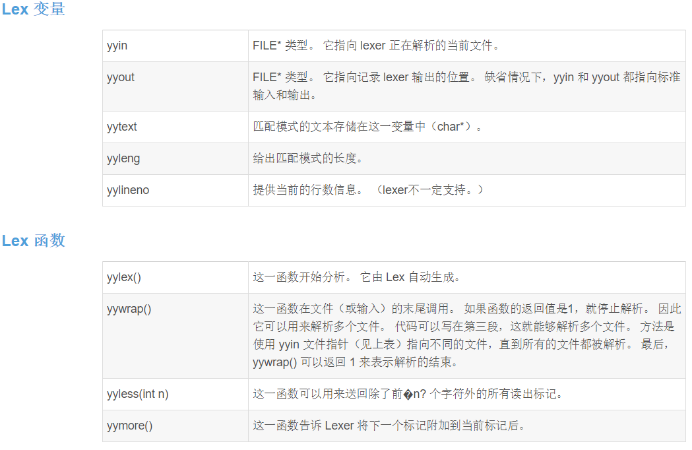

# CS143
斯坦福2022春编译原理实验

cs143官方网站：http://web.stanford.edu/class/cs143/

此处的实验一与官网不同，官网是直接开始做词法分析，而本实验一是熟悉cool语言。cool语言是用于教学的面向对象语言，Classroom Oriented Object Language。注意，在做实验之前，一定要熟悉好
cool语言，毕竟你是要开发cool语言的编译器的，不熟悉cool语言语法怎么写编译器呢嘻嘻。主要是对cool_manual.pdf的阅读，私以为看1-12章即可。注意一定要熟悉.

## PA1

实验一是写一个栈机器，目的是熟悉cool语言。我觉得关键在三点。

一是熟悉题目要求：如图

二是熟悉cool语法：

由于cool编译器非常不友好，报错很不明显。所有必须先熟悉好cool语法才能写下去。我就是一开始太急了，没有完全熟悉就开始写（老毛病了）。我犯错：一没有明白对象的字段全部是私有的，在外部不
能直接调用，manual原文： Attributes are visible throughout a class in which they are declared or inherited,二不知道不能对self进行赋值，self是不能修改的，原文：The 
identifier self may be referenced, but it is an error to assign to self or to bind self in a let, acase, or as a formal parameter. It is also illegal to have 
attributes named self.二者均可以用设立setter和getter方法去破解。熟悉了语法，做起来还是很轻松的。

三是是注意atoi.cl文件的使用，可以调用A2I类相关接口实现String和Int之间的转化。指导书原文：If you wish, youmay use the classes defined in atoi.cl

注意以上三点，实验一还是很轻松的

## PA2

从实验二开始就正式进入编写cool语言编译器了。实验二是词法分析，使用工具flex。故在开始编写程序之前一定要熟悉好flex的使用，还有便是充分阅读PA2.pdf熟悉实验要求，最后是注意阅读cool——
manual的第10章。

在此记录flex的学习笔记先：

flex语法分为三个部分（可以省略这些部分，不一定全部都有）：

definition
%%
rules
%%
user code

下面对三个部分进行分析

definition部分主要是两部分：第一部分是使用c语言代码进行预处理，比如引入头文件、定义宏。语法完全同c语言。定义于%{ %}包裹的部分。第二部分可以进行flex自己的定义，如一些正则表达式的定义
如： IDENTIFIER [a-zA-Z_]+[a-zA-Z0-9_]*

rules部分是对匹配相应的字符串进行相应操作，没有被匹配的原封不动写入输出文件，被匹配但是不采取任何动作的被丢弃。匹配有两个原则，一是尽可能匹配长的字符串；二是同等长度匹配，前面的优先被
匹配。写法如下：{正则表达式或定义}		{ 动作 }。如果按这样的格式：

正则表达式 {
}

注意正则表达式一定要顶格，不能加空格。其次是正则表达式和“{”间必须有空格。“}”也需顶格。

user code部分是相应代码，这部分由于实验用不到，暂时省略

lex函数与变量：

词法分析大概可以分为一下几个部分：

- 单行注释
- 多行注释
- 字符串常量
- 标识符
- 运算符号
- 数字常量
- 布尔常量
- 空白符号
- 其他

除了前三个，后面较为简单。注意运算符号好像没有>，这是通过实验给的lexer测出来的，空白符这不要漏掉空格。其余均可在指导书中获取信息。

现在解析前三个如何词法分析。这三个分别为single_line,comment,string状态。

若遇到--则进入single_line，结束标志为换行符。

若遇到（* 则进入comment，在多行注释中需要注意，若遇到eof，则必须转入initial状态，否则会陷入无限循环。其次便是遇到*）则需要退出多行注释状态，这点实现稍微复杂，要确保*）不会被匹配称为
comment的一部分。

若遇到"则进入string，主要麻烦在转义字符的匹配。首先对于\\、\n、\0、\"四个符号之外可以随意匹配。遇到eof则需要转入initial状态。遇到//则分情况讨论，若接下来是\n，则需要行数++，其余只
需继续匹配即可。遇到\n则返回error，

